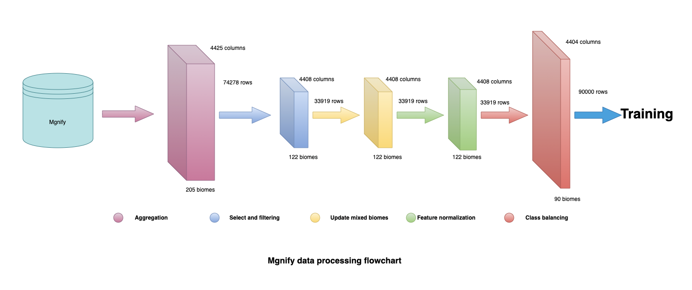

# Data processing pipeline: 

1. transform:from Mgnify database generating go_aggregated.tsv file 
2. get_labels: get biome labels for go_aggregated.tsv file 
3. remove_duplicated_rows: remove dplicated rows 
4. generate_dataset: creating dataset for Catboost model: the input tsv file will be randomly splited to train, validation and test dataset, this steps is not neccessary if pandas dataframe is used to run Catboost model  
5. feature_normalization: scale all numerical features into range (0,1) 
6. dataset_balancing: using oversample tool SMOTE to balance data 
